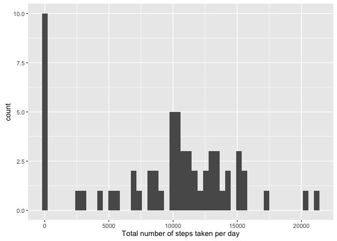
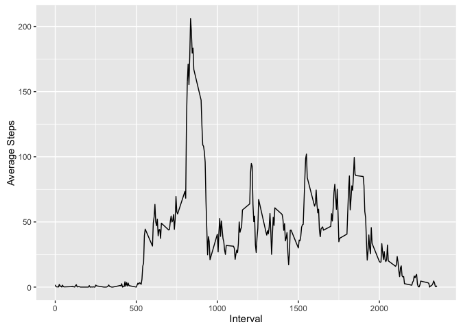
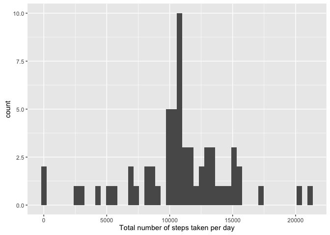
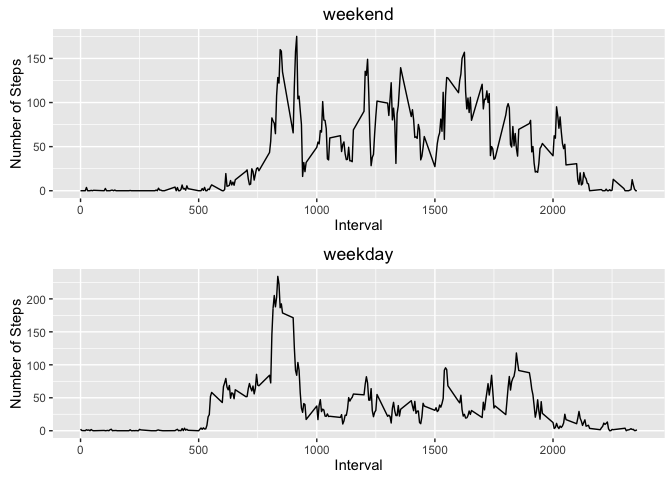

# Reproducible Research: Peer Assessment 1

## Loading and preprocessing the data


```r
library(ggplot2)
library(dplyr)
```

```
## 
## Attaching package: 'dplyr'
```

```
## The following objects are masked from 'package:stats':
## 
##     filter, lag
```

```
## The following objects are masked from 'package:base':
## 
##     intersect, setdiff, setequal, union
```

```r
library(gridExtra)
```

```
## 
## Attaching package: 'gridExtra'
```

```
## The following object is masked from 'package:dplyr':
## 
##     combine
```

```r
activity <- read.csv('activity.csv')
```

## What is mean total number of steps taken per day?

```r
dateGroup <- group_by(activity, date) %>% summarize(dailystep = sum(steps, na.rm=TRUE))
qplot(dateGroup$dailystep, geom='histogram', bins = 50, xlab = 'Total number of steps taken per day')
```

<!-- -->

```r
# mean
mean(dateGroup$dailystep)
```

```
## [1] 9354.23
```

```r
# median
median(dateGroup$dailystep)
```

```
## [1] 10395
```


## What is the average daily activity pattern?

```r
intervalG <- group_by(activity, interval) %>% summarise(intervalstep = mean(steps, na.rm=TRUE))
qplot(interval, intervalstep, data = intervalG, geom='line', xlab = 'Interval', ylab = 'Average Steps')
```

<!-- -->

```r
# 5-minute interval containing maximum number of steps
maxindex <- with(intervalG, match(max(intervalstep), intervalstep))
intervalG$interval[maxindex]
```

```
## [1] 835
```


## Imputing missing values

```r
nadata <- activity[is.na(activity$steps), ]
# total number of missing values 
length(nadata$steps)
```

```
## [1] 2304
```

```r
# replace missing data with interval average
activityNA <- group_by(activity, interval) %>% mutate(steps= replace(steps, is.na(steps), as.integer(mean(steps, na.rm=TRUE))))
# histogram of the total number of steps taken each day for new data
dateGroupNA <- group_by(activityNA, date) %>% summarize(dailystep = sum(steps))
qplot(dateGroupNA$dailystep, geom='histogram', bins = 50, xlab = 'Total number of steps taken per day')
```

<!-- -->

```r
# mean
mean(dateGroupNA$dailystep)
```

```
## [1] 10749.77
```

```r
# median
median(dateGroupNA$dailystep)
```

```
## [1] 10641
```
* The mean and median values are different from the estimates from the first part of the assignment.  
* Inputing missing value normalized the data. Since the replaced data is calculated based on interval averages, the data is clustered in the middle of the histogram as compared to the first plot.

## Are there differences in activity patterns between weekdays and weekends?

```r
# create weekday variable
activity$dow <- factor((weekdays(as.Date(activity$date)) %in% c('Saturday', 'Sunday')), levels = c(TRUE, FALSE), labels = c('weekend', 'weekday'))
# create plot
weekend <- group_by(activity[activity$dow == "weekend", ], interval) %>% summarise(intervalstep = mean(steps, na.rm=TRUE))
weekday <- group_by(activity[activity$dow == "weekday", ], interval) %>% summarise(intervalstep = mean(steps, na.rm=TRUE))
p1 <- qplot(interval, intervalstep, data = weekend, geom='line', xlab = 'Interval', ylab = 'Number of Steps') + labs(title = "weekend")
p2 <- qplot(interval, intervalstep, data = weekday, geom='line', xlab = 'Interval', ylab = 'Number of Steps') + labs(title = "weekday")
grid.arrange(p1, p2)
```

<!-- -->
